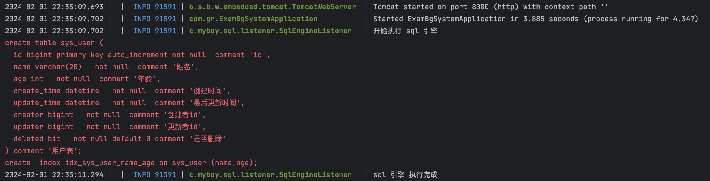
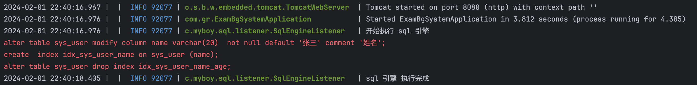
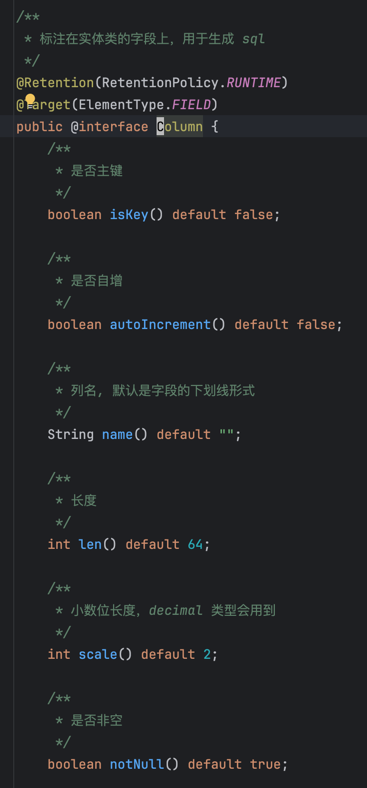
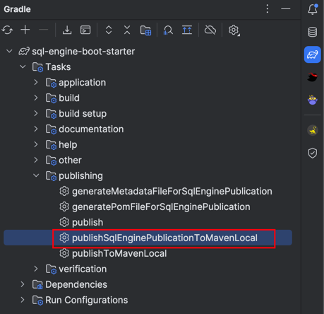
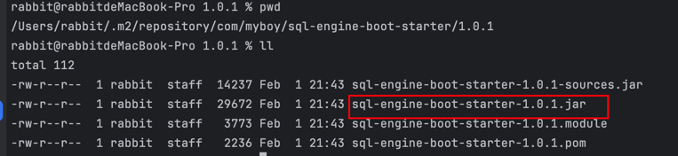
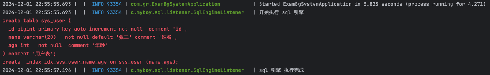

<h3></h3>

## 🌈概述
SqlEngine 是一个基于实体类注解的数据库 SQL 自动生成框架。开发者只需关注实体类的操作，框架将自动生成相应的 DDL 语句。
经过作者精心打磨，该框架能显著提升开发效率，更是一款实用的工具，助力Java开发者轻松实现提前下班的美好梦想😅

SqlEngine 是作者在业余时间开发的小工具，仅在本人做的一些项目中得到了一些实践，测试条件比较局限，如果在你的项目中运行不起来，
可以直接给我提 issue，在空余时间我会即使修复问题，希望在大家的反馈中，项目会越来越完善，下面我也会列举出本框架适用的环境，
大家在使用之前最好先确认一下，假设不满足你的需求，可以给我提 feature，或者修改我的代码，给我提 PR

最后，您的 star 是我继续前进的动力，如果喜欢 SqlEngine 请右上角帮忙点个star


## 🏔️实现效果
**生成建表、建索引 SQL**


**生成改表 SQL**



## 🍬适用环境
* **SpringBoot 3**
* **MySQL 5.7**
* **JDK 17**


## 🛕功能注解
* **@Table:** 标注在实体类上，用于生成表名和表注释
* **@Column:** 标注在实体类字段上，用于生成数据库字段
* **@Index:** 标注在实体类字段上，用于生成表索引

至于注解内可以配置什么，大家自行点进源码里看好了，注释都写的很详细的


## ☘️快速开始

### 1、首先 clone 项目源码到本地，适用 idea 打开，idea 会自动下载 gradle 8.5 到本地并完成项目的构建

### 2、调用 gradle 的 task 来发布本 sql-engine-boot-starter 到本地 maven 仓库


## 3、检查本地 maven 仓库是否保存了此依赖


## 4、在你的项目中引入此依赖
maven
```xml
<dependency>
    <groupId>com.myboy</groupId>
    <artifactId>sql-engine-boot-starter</artifactId>
    <version>1.0.1</version>
</dependency>
```

gradle
```groovy
implementation("com.myboy:sql-engine-boot-starter:1.0.1")
```

## 5、配置数据源、配置要扫描的实体类包名
application.properties
```properties
# mysql
spring.datasource.driver-class-name=com.mysql.cj.jdbc.Driver
spring.datasource.url=jdbc:mysql://127.0.0.1:3306/test?characterEncoding=utf8&serverTimezone=Asia/Shanghai&useSSL=false&allowPublicKeyRetrieval=true&rewriteBatchedStatements=true
spring.datasource.username=root
spring.datasource.password=1234

# sql
sql.base-package=com.gr.**.entity.*
```

## 6、在上面配置的包下面添加实体类
```java
@Table(name = "sys_user", comment = "用户表")
public class SysUser {

    @Column(isKey = true, autoIncrement = true, comment = "id")
    private Long id;

    @Index(name = "idx_sys_user_name_age", fields = {"name", "age"})
    @Column(len = 20, comment = "姓名", defaultVal = "'张三'")
    private String name;

    @Column(comment = "年龄")
    private Integer age;
}
```

## 7、启动 springboot 项目，查看打印的日志
